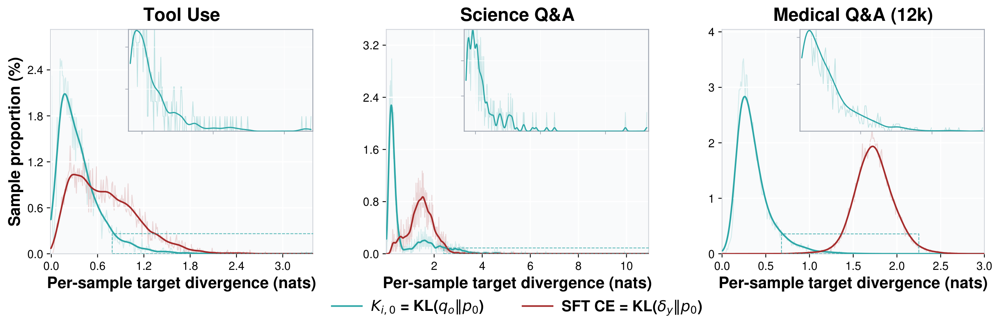
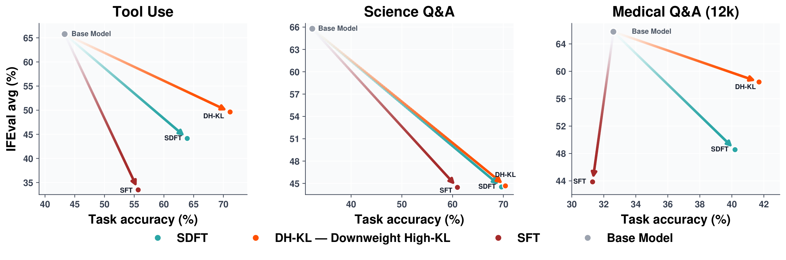

# Trust-Region Constrained Self-Distillation (TRSD)

Code for

> **Trust-region Constraints Improves Continual Learning of Self-distillation Fine-tuning**

## Introduction

Continually adapting large language models to new domains risks erasing capabilities acquired during pretraining. Self-Distillation Fine-Tuning (SDFT; [Shenfeld et al., 2026](https://arxiv.org/abs/2601.19897); [code](https://github.com/Continual-Intelligence/Self-Distillation)) mitigates this problem by using a demonstration-conditioned version of the model as an on-policy teacher. We show, however, that although this teacher is substantially closer to the student than one-hot supervision on average, its teacher–policy divergence remains strongly heavy-tailed across model families and adaptation domains. A controlled down-weighting intervention further shows that high-divergence teachers contribute disproportionately to forgetting. Motivated by this finding, we introduce Trust-Region Constrained Self-Distillation Fine-Tuning (TRSD), which constructs a sample-wise trust-region-constrained teacher distribution that remains faithful to the demonstration-conditioned teacher while limiting its divergence from the current student. Formulated over the f-divergence family, TRSD induces distinct teacher-distribution geometries for forward KL, reverse KL, and squared Hellinger distance without requiring an additional model forward pass beyond SDFT. Across tool use, scientific question answering, and medical reasoning, TRSD improves instruction-following over SDFT, generally without requiring weaker task accuracy. These gains persist under sequential adaptation and broad hyperparameter sweeps. Our results establish teacher calibration as an important principle for continual self-distillation.



*Per-sample target-divergence distributions for SDFT and SFT on Qwen2.5-7B-Instruct across three domains. Solid curves show Gaussian-smoothed proportions, faint curves show raw bins, and insets magnify the right tails.*



*Effect of down-weighting high-divergence examples on Qwen2.5-7B-Instruct. Panels report new-task accuracy and retained IFEval for SFT, SDFT, and high-KL down-weighting (DH-KL) across three domains.*

The same construction is instantiated for three f-divergences. Each TRSD run is compared with SDFT under the **same** divergence. In the paper the teacher weight is beta: beta = 1 leaves the demonstration teacher unchanged and recovers SDFT, and beta = 0 is the current policy. The code uses tau = 1 - beta, so SDFT is `--proximal_teacher_tau 0`.


| Paper             | SDFT (beta = 1, tau = 0)                                                                      | TRSD                                                                                                                    |
| ----------------- | --------------------------------------------------------------------------------------------- | ----------------------------------------------------------------------------------------------------------------------- |
| Forward KL        | `--alpha 0 --proximal_teacher_tau 0`                                                          | `--online_sample_tau_mode budget_log_ratio_var_relative`                                                                |
| Reverse KL        | `--alpha 1 --proximal_teacher_tau 0`                                                          | `--alpha 1 --online_sample_tau_mode budget_chi2_relative`                                                               |
| Squared Hellinger | `--distillation_divergence hellinger --proximal_selection hellinger --proximal_teacher_tau 0` | `--distillation_divergence hellinger --proximal_selection hellinger --online_sample_tau_mode budget_hellinger_relative` |


Forward KL and reverse KL both use `--distillation_divergence kl` (the default). The remaining flags are in the launch scripts.

## Layout

```text
main.py                         SDFT and TRSD
main_sft.py                     SFT (--loss_type sft) and DFT (--loss_type dft)
eval_{tooluse,science,medical}.py
                                task eval
scripts/single/*.sh             one cell: train, then new task + IFEval
scripts/cross/*.sh              Tool → Science → Medical
data/{tooluse,science,medical}_data/
model/                          empty; put base weights here
```


## Environment

```bash
conda create -n trsd python=3.11 -y
conda activate trsd
pip install -r requirements.txt
```

`requirements.txt` is the stack used for the paper runs (PyTorch 2.9, Transformers 4.57, vLLM 0.12, TRL 0.24). Training was run on one H200. The launch scripts activate conda env `trsd` unless you set `CONDA_ENV`.

Base weights are not in this repo:

```bash
# Qwen/Qwen2.5-7B-Instruct
# internlm/internlm2_5-7b-chat
ln -s /path/to/Qwen2.5-7B-Instruct model/Qwen2.5-7B-Instruct
ln -s /path/to/internlm2_5-7b-chat  model/InternLM2.5-7B-Chat
```

Medical training uses `data/medical_data/train_data` (12,288 examples). Scoring uses the HuatuoGPT-o1 outcome verifier (`FreedomIntelligence/medical_o1_verifier_3B`):

```bash
huggingface-cli download FreedomIntelligence/medical_o1_verifier_3B \
  --local-dir model/medical_o1_verifier_3B
```

IFEval is `lm-eval` (`pip install lm-eval` if it is not already pulled in). Task eval does not need it.

## Single task

Each script trains one domain from the base model, then evaluates that new task and IFEval.

```bash
GPU=0 bash scripts/single/qwen_tooluse_forward_trsd.sh
GPU=0 bash scripts/single/qwen_tooluse_forward_sdft.sh
GPU=0 bash scripts/single/internlm_medical_hellinger_trsd.sh
```

The dispatcher is the same thing with arguments:

```bash
GPU=0 bash scripts/run_single.sh <qwen|internlm> <tooluse|science|medical> <forward|reverse|hellinger> <trsd|sdft>
```

Files are `scripts/single/{qwen,internlm}_{tooluse,science,medical}_{forward,reverse,hellinger}_{trsd,sdft}.sh`. Finished stages are skipped; set `SKIP_IF_DONE=0` to force them.

## Sequential adaptation

Order is Tool → Science → Medical. The next stage loads the previous stage's `output_dir`. After Science, the new task is Science and the old task is Tool. After Medical, the new task is Medical and the old tasks are Tool and Science. IFEval is evaluated at every stage. Earlier tasks are written to `eval_*_after_cross/`.

```bash
GPU=0 bash scripts/cross/qwen_forward_trsd.sh
GPU=0 bash scripts/cross/qwen_forward_sdft.sh
GPU=0 bash scripts/run_cross.sh internlm reverse trsd
```

Checkpoints land in `outputs/{model}_cross_{geometry}_{method}/{tool,science,medical}`.

## SFT and DFT

```bash
GPU=0 bash scripts/single/qwen_tooluse_sft.sh
GPU=0 bash scripts/single/qwen_tooluse_dft.sh
GPU=0 bash scripts/run_sft.sh internlm science dft
```

Files are `scripts/single/{qwen,internlm}_{tooluse,science,medical}_{sft,dft}.sh`. Same evaluation as the single-task scripts: the new task and IFEval.

## Citation

```bibtex
@misc{trsd,
  title  = {Trust-region Constraints Improves Continual Learning of Self-distillation Fine-tuning},
  author = {Anonymous},
  year   = {2026},
  note   = {Preprint}
}

@article{sdft,
  title   = {Self-Distillation Enables Continual Learning},
  author  = {Shenfeld, Idan and Damani, Mehul and H{\"u}botter, Jonas and Agrawal, Pulkit},
  journal = {arXiv preprint arXiv:2601.19897},
  year    = {2026}
}
```

Base weights, the medical verifier, and third-party data stay under their original licenses.